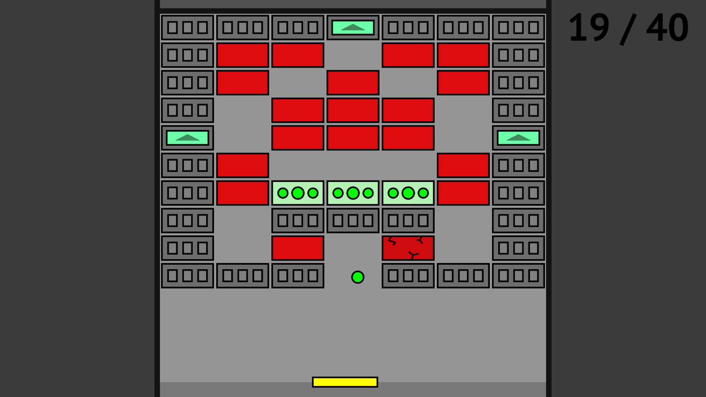
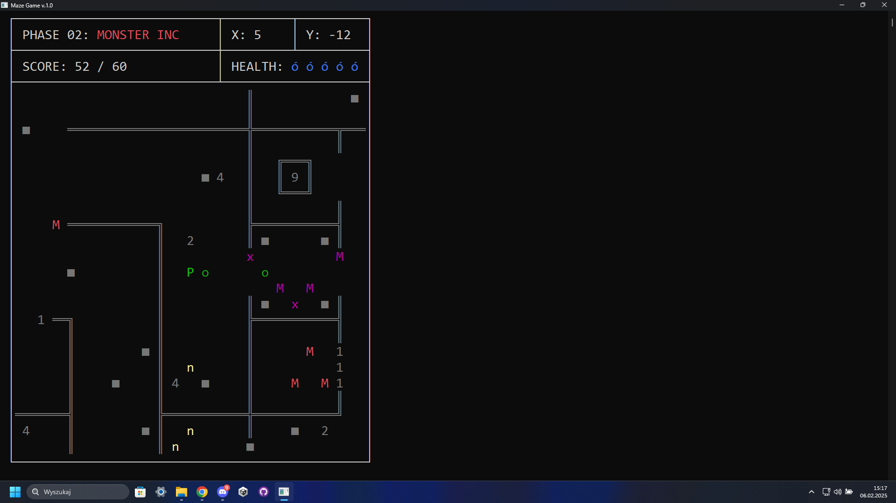
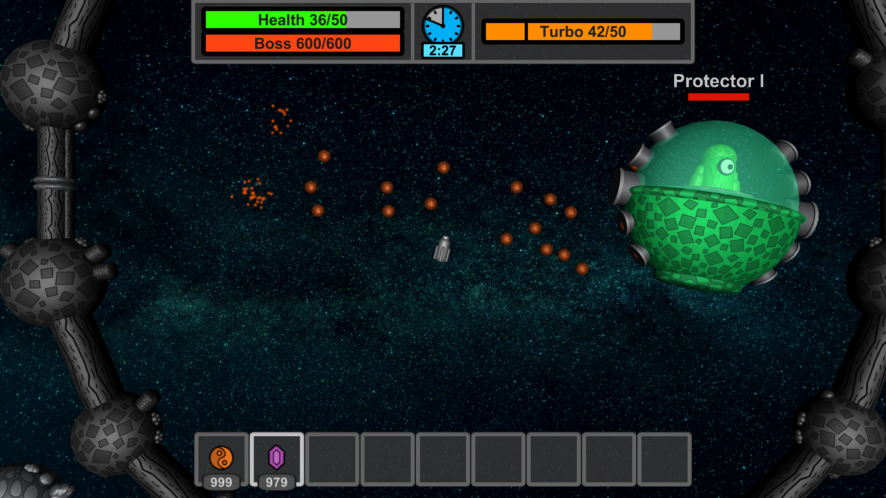
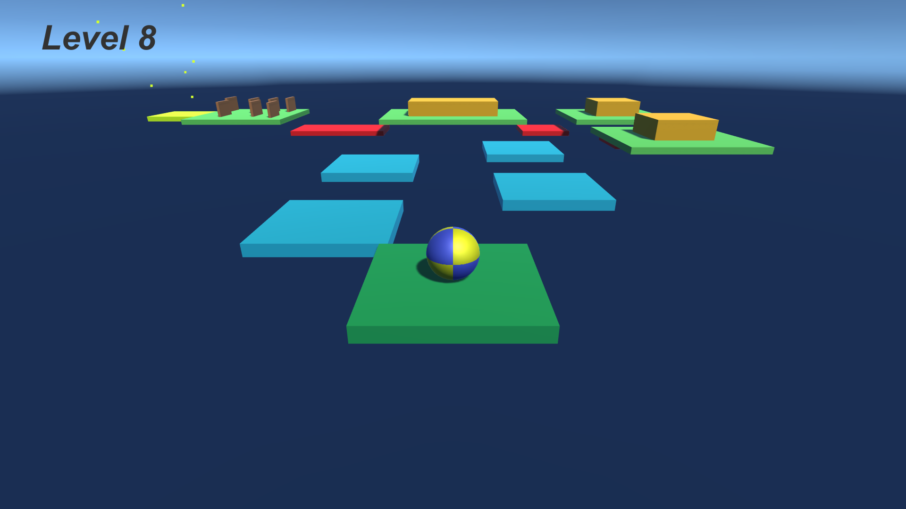

# Projects I have Already Finished

> *Every project listed here is open-source and available on my GitHub profile.*

## Brick Breaker
A university project written in C++ using SFML with [Peccator](https://github.com/michalkosiec/) and [Julian](https://github.com/JulianGranieczny/). It is the Arkanoid-like game, where you need to clear levels
with a ball and the paddle. [Check repository](https://github.com/Kamiloso/BrickBreaker).  
|  |
| ------------------------------- |

## Maze Game
A university project written in C++ for Windows. It’s a console game where you fight enemies in a maze and try to achieve the highest score possible. [Check repository](https://github.com/Kamiloso/Maze-Game).  
|  |
| ---------------------------|

## Space Eternity 3
My flagship Unity project. In this game, you explore a procedurally generated world while managing your inventory, with the main goal being to fight and defeat bosses.
The game also features an online multiplayer mode. [Check repository](https://github.com/Space-Eternity-3/Space-Eternity-3).  
|  |
| ---------------------------- |

I have written a website for Space Eternity 3 with [Nadwey](https://github.com/Nadwey/) (the creator of the SE3 Launcher) using Docusaurus. It includes a download page, instructions for running the game, and documentation for datapacks.
[Check repository](https://github.com/Space-Eternity-3/SE3-Website) or see the website [here](https://se3.page).  

## Rollball
A simple Unity game where you control a ball and complete levels. It's one of my oldest projects. [Check repository](https://github.com/Kamiloso/Rollball).  
|  |
| ------------------------- |

# Future Plans
- The Galactic Launcher project... 🔭
- More games!
