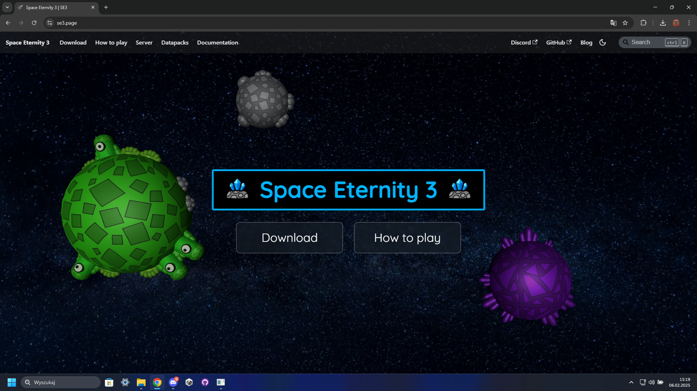

# Projects I have already finished

## Maze Game
A university project written in C++ for Windows. It’s a console game where you fight enemies in a maze and try to achieve the highest score possible.  
- Repository: [here](https://github.com/Kamiloso/MazeGame/)
|  |
| ---------------------------|

## Space Eternity 3
My flagship Unity project. In this game, you explore a procedurally generated world while managing your inventory, with the main goal being to fight and defeat bosses. The game also features an online multiplayer mode.  
- Repository: [here](https://github.com/Kamiloso/MazeGame/)
- Trailer: *soon*
|  |
| ---------------------------- |

## SE3 website
I created the [se3.page](https://se3.page/) website for Space Eternity 3 using Docosaurus. It includes a download page, instructions for running the game, and documentation for datapacks.  
Repository: [here](https://github.com/Kamiloso/MazeGame/)
Website: [here](https://se3.page/)
|  |
| ------------------------ |

## Rollball
A simple Unity game where you control a ball and complete levels.  
Repository: [here](https://github.com/Kamiloso/Rollball/)
Trailer: [here](https://github.com/Kamiloso/Rollball/)
|  |
| ------------------------- |

# Future Plans
- Modify the SE3 launcher to allow uploading games other than Space Eternity 3.
- More games!
